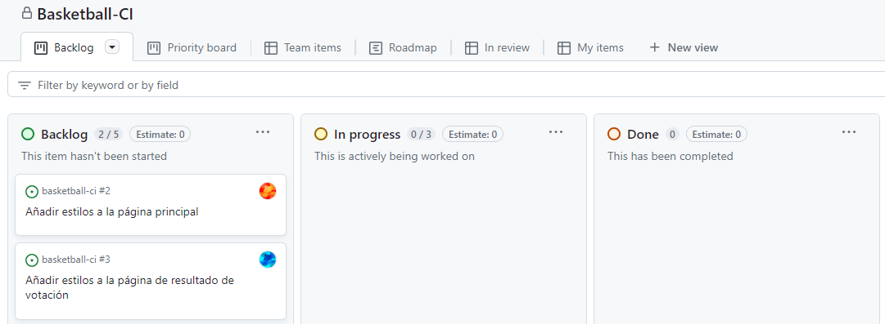
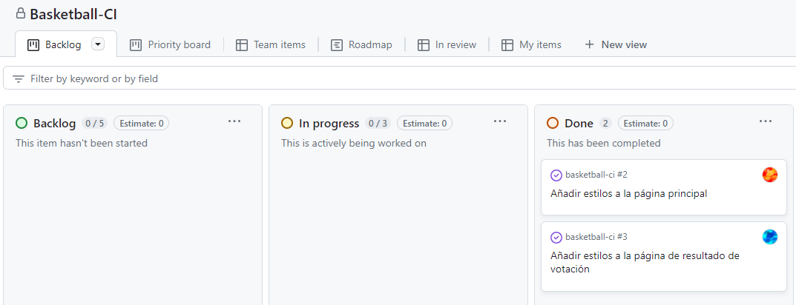
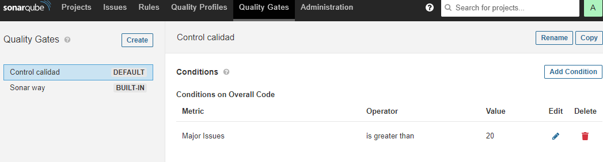

# Memoria

## Controles

Se ha añadido otra cuenta visible en Kanban, aunque las tareas se han hecho por la cuenta principal.





## Problemas con el entorno de prueaba

### GitHub Runner

El GitHub Runner implementado en el imagen de Docker **josehilera/ubuntu-ci** tiene un versión antigua y deprecated en GitHub, no permite ejecutar los tests de la aplicación.

Se ha creado [un imagen propio](./doc/Dockerfile) añadiendo a secas la última version de Runner, que es la 2.313.0.

Para crear la imagen, dentro del directorio "doc":

```bat
docker build . -t ubuntun-ci-313
```

### SonarQube

La última versión de imagen Docker de SonarQube tiene entorno de Java con un versión demasiada avanzada, y no es compatible con el plugin de SonarQube usado en el proyecto. Se ha optado por utilizar la versión 8.9.10 de SonarQube.

## Inicial entorno de pruebas

Se hacen en orden los siguientes pasos para iniciar el entorno de pruebas.

### Iniciar SonarQube con Docker

```bat
docker run -d --name sonarqube -p 9000:9000 sonarqube:8.9.10-community
```

Entrando al sistema, se establece la contraseña de administrador a `admin1`, usado por workflow de GitHub Actions.

Y se configura el Quality Gate para permitir hasta 20 problemas importantes:



### Iniciar el runner de GitHub

```bat
docker run -it --name ubuntu-ci -p 8080:8080 -p 3306:3306 --link sonarqube ubuntun-ci-313
```

Una vez dentro del sistema:

```sh
# Hay que ir a la página de Actions Runner del repositorio y copiar el token de registro, que es de único uso.
./config.sh --disableupdate --url https://github.com/liu-hanli/basketball-ci --token <token>

./run.sh
```

Después de reiniciar el imagen, se puede iniciar el runner con estos pasos:

```bat
docker exec -it ubuntu-ci /bin/sh
```

Una vez dentro del sistema:

```sh
./run.sh
```

## Configuraciones para workflows

### Pre-producción

Se usa una rama llamada `staging` para pre-producción, en el que publica la aplicación en otro App Service de Azure, hay que usar un perfil de publicación diferente, como otro secreto de GitHub.

Dentro de la configuración de GitHub Actions, se ha añadido un nuevo job llamado `staging`, que hace un despliegue continuo cuando se hace un push en esta rama de `staging`, comprobando todas las pruebas unitarias y funcionales.

El Job `staging` se ejecuta como siguiente del job `qa`, pero continua aunque este último falle; y se coloca en paralelo con el job `deploy`, aunque solo uno de los dos puede ejecutarse para cada push.

### Producción

Se hace sobre la rama `main`, que publica la aplicación en el App Service de Azure.

Se ha cambiado el job de `qa` para que no continúe si falla para un push al rama `main`, y se ha añadido un nuevo job llamado `deploy` que hace el despliegue continuo.

## Implementaciones

### Funciones de la aplicación

Se ha implementado un Servlet y un botón en página principal para cada requisito, añadiendo accesos correspondientes en el `web.xml`, y consultas SQL al base de datos.

Para ver los votos, se ha creado una nuava página `VerVotos.jsp` con una tabla que muestra los votos de cada jugador.

### Pruebas unitarias

En este caso, la prueba unitaria se realiza a un base de datos completamente simulada, que de momento no se configura el entorno para pruebas unitarias.

La simulación se realiza mediante Mockito, que simula el comportamiento de Connection, Statement y ResultSet de JDBC, devolviendo valores que tengan sentido para las pruebas.

### Pruebas funcionales

Ahora que si se prueba con un base de datos real, se ha creado pruebas con Selenium WebDriver, que simula el comportamiento de un usuario real, y comprueba que la aplicación funciona correctamente.
